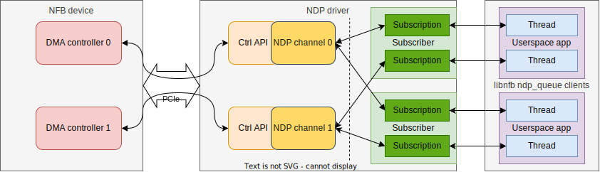

NDP submodule
=============

The NDP driver is an embedded submodule of the NFB driver.
It is the module responsible for DMA data transfer.

.. _ndp_driver_diagram_simple:

    Diagram of general communication chain between the DMA Module in a NFB device and user applications.

The general diagram of the entire communication chain is described in the :ref:`diagram <ndp_driver_diagram_simple>` above.

NDP drivers allows data sharing between kernel space and user space processes.
It also connects DMA controllers inside firmware to NDP queues (channels).

It allows to connect multiple user space processes (subscribers) to one NDP queue via subscriptions and also allows
one application to connect to multiple queues.

Driver modes
^^^^^^^^^^^^

The driver currently supports two protocols: the SZE (*Straight Zero Copy*) and the Packet mode.

SZE mode
--------

The SZE (also refered to as "*version 1*" in Libnfb) is a streaming mode supported by older version of DMA controllers.
In this mode the driver allocates data for packets in the RAM as a single ring buffer where packets are placed one after another.
This is practical for PCI throughput usage, since, when transfering small packets, you can transfer multiple of them at once in a single PCI transaction.
The user, however, cannot be expected to work with packets stored in the RAM this way and so the driver has to copy each of them creating unwanted overhead.

Packet mode
-----------

In the Packet mode (called "*version 2*" in Libnfb) each packet is stored in the RAM individualy.
This prevents the DMA Module from transfering multiple packets in one transaction, but allows them to be handled more easily in software.
This mode is only currently only supported by the newer DMA module called "DMA Medusa".

For easier implementation they are stored in a single (virtually) buffer much like in SZE, but each packet has a predefined block of memory it can occupy (with a fixed starting address).
This frees the user of the responsibility of low-level memory management.

This mode involves the Header buffer.

Details of synchronization between NDP driver and userspace library are described in :ref:`ndp_rx_sync` and :ref:`ndp_tx_sync`.

Device Tree
~~~~~~~~~~~
Occupied node: ``/drivers/ndp``

- property ``version``
   uint32 - version of API
- nodes ``rx_queues/rx%d``
- nodes ``tx_queues/tx%d``

nodes ``rx%d`` and ``tx%d``:
    - property size: Size of buffer
    - property mmap_base: base address for mmap of channel ring
    - property mmap_size: Size that can be maped (typically 2 * size for shadowing in NDP)
    - property ctrl: phandle reference to DMA controller in ``/firmware`` node

IOCTL
~~~~~

The Subscribe IOCTL call takes the :c:type:`ndp_channel_request` struct.
The others IOCTL calls takes the :c:type:`ndp_subscription_sync` struct.

- SUBSCRIBE
- START
- STOP
- SYNC
